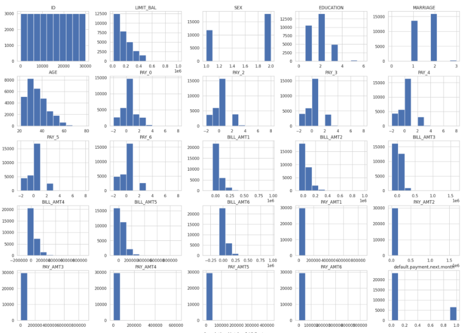
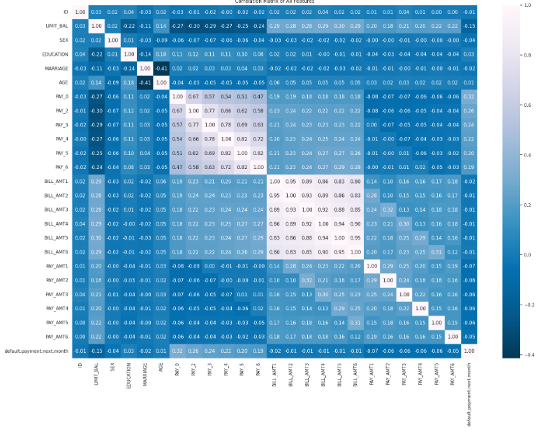
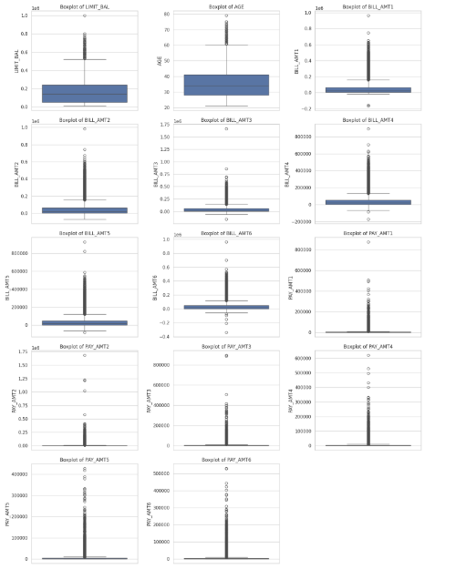
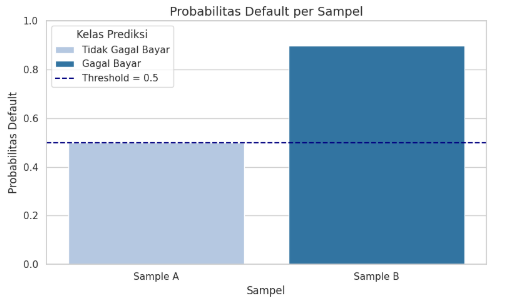

# Laporan Proyek Machine Learning - MC172D5X1392 Richelle Vania Thionanda

## Domain Proyek

**1. Latar Belakang**

Penggunaan kartu kredit telah menjadi bagian penting dari sistem keuangan modern. Namun, banyak lembaga keuangan menghadapi risiko kegagalan pembayaran (default) oleh nasabah. Dengan meningkatnya jumlah transaksi kredit dan kompleksitas penilaian kelayakan kredit, pendekatan manual tidak lagi cukup. Oleh karena itu, machine learning menjadi solusi yang potensial untuk membantu memprediksi kemungkinan gagal bayar nasabah dengan lebih akurat dan efisien.

**2. Urgensi dan Alasan Penyelesaian Masalah**

Prediksi ini penting karena dapat membantu lembaga keuangan:
- Mengurangi risiko kerugian finansial.
- Meningkatkan kualitas pengambilan keputusan pemberian kredit.
- Meningkatkan efisiensi dan akurasi dalam penilaian risiko kredit.

**Referensi Tambahan**
The comparisons of data mining techniques for the predictive accuracy of probability of default of credit card clients (https://www.sciencedirect.com/science/article/abs/pii/S0957417407006719?via%3Dihub)

## Business Understanding

### Problem Statements

Menjelaskan pernyataan masalah latar belakang:
- Bagaimana memprediksi apakah seorang nasabah akan mengalami gagal bayar pada bulan berikutnya berdasarkan data historis?
- Bagaimana mengatasi ketidakseimbangan kelas dalam data default pembayaran?

### Goals

Menjelaskan tujuan dari pernyataan masalah:
- Mengembangkan model klasifikasi untuk mendeteksi potensi gagal bayar.
- Meningkatkan performa prediksi dengan preprocessing dan balancing data.


### Solution statements
- Membangun baseline model menggunakan deep learning (Neural Network).
- Melakukan peningkatan kinerja model dengan hyperparameter tuning, dropout, dan batch normalization.
- Menangani imbalance data menggunakan SMOTE.
- Menggunakan metrik F1 Score untuk mengevaluasi performa model pada data tidak seimbang.

## Data Understanding
Dataset yang digunakan berasal dari [Default of Credit Card Clients Dataset - Kaggle](https://www.kaggle.com/datasets/uciml/default-of-credit-card-clients-dataset). Dataset tersebut kemudian diunggah ulang ke GitHub dan digunakan melalui tautan berikut: [GitHub Dataset Link](https://github.com/richellevania/Submission-Predictive-Analytics/blob/main/credit_card.csv.)  Dataset ini berisi informasi mengenai pembayaran gagal bayar, faktor demografi, data kredit, riwayat pembayaran, dan laporan tagihan nasabah kartu kredit. Terdiri dari 30.000 jumlah baris dan 25 jumlah kolom (Variabel).

### Variabel-variabel pada dataset adalah sebagai berikut:
Variabel-variabel dalam dataset:
- ID: ID unik setiap klien.
- LIMIT_BAL: Jumlah kredit yang diberikan dalam NT dollar (termasuk kredit individu dan keluarga/tambahan).
- SEX: Jenis kelamin (1=laki-laki, 2=perempuan).
- EDUCATION: Tingkat pendidikan (1=pascasarjana, 2=universitas, 3=SMA, 4=lainnya, 5=tidak diketahui, 6=tidak diketahui).
- MARRIAGE: Status perkawinan (1=menikah, 2=lajang, 3=lainnya).
- AGE: Usia dalam tahun.
- PAY_0: Status pembayaran di September 2005 (-1=bayar tepat waktu, 1=telat bayar satu bulan, 2=telat bayar dua bulan, ... 8=telat bayar delapan bulan, 9=telat bayar sembilan bulan atau lebih).
- PAY_2: Status pembayaran di Agustus 2005 (skala sama dengan di atas).
- PAY_3: Status pembayaran di Juli 2005 (skala sama dengan di atas).
- PAY_4: Status pembayaran di Juni 2005 (skala sama dengan di atas).
- PAY_5: Status pembayaran di Mei 2005 (skala sama dengan di atas).
- PAY_6: Status pembayaran di April 2005 (skala sama dengan di atas).
- BILL_AMT1: Jumlah tagihan di September 2005 (NT dollar).
- BILL_AMT2: Jumlah tagihan di Agustus 2005 (NT dollar).
- BILL_AMT3: Jumlah tagihan di Juli 2005 (NT dollar).
- BILL_AMT4: Jumlah tagihan di Juni 2005 (NT dollar).
- BILL_AMT5: Jumlah tagihan di Mei 2005 (NT dollar).
- BILL_AMT6: Jumlah tagihan di April 2005 (NT dollar).
- PAY_AMT1: Jumlah pembayaran sebelumnya di September 2005 (NT dollar).
- PAY_AMT2: Jumlah pembayaran sebelumnya di Agustus 2005 (NT dollar).
- PAY_AMT3: Jumlah pembayaran sebelumnya di Juli 2005 (NT dollar).
- PAY_AMT4: Jumlah pembayaran sebelumnya di Juni 2005 (NT dollar).
- PAY_AMT5: Jumlah pembayaran sebelumnya di Mei 2005 (NT dollar).
- PAY_AMT6: Jumlah pembayaran sebelumnya di April 2005 (NT dollar).
- default.payment.next.month: Status default pembayaran bulan berikutnya (1=ya, 0=tidak).

## Exploratory Data Analysis:
- **Mengecek Informasi & Statistik Deskriptif Dataset**: Menggunakan `.info` dan `.describe` untuk mengetahui informasi awal dan statistik deskriptif dari dataset.
```
Basic Information:
<class 'pandas.core.frame.DataFrame'>
RangeIndex: 30000 entries, 0 to 29999
Data columns (total 25 columns):
 #   Column                      Non-Null Count  Dtype  
---  ------                      --------------  -----  
 0   ID                          30000 non-null  int64  
 1   LIMIT_BAL                   30000 non-null  float64
 2   SEX                         30000 non-null  int64  
 3   EDUCATION                   30000 non-null  int64  
 4   MARRIAGE                    30000 non-null  int64  
 5   AGE                         30000 non-null  int64  
 6   PAY_0                       30000 non-null  int64  
 7   PAY_2                       30000 non-null  int64  
 8   PAY_3                       30000 non-null  int64  
 9   PAY_4                       30000 non-null  int64  
 10  PAY_5                       30000 non-null  int64  
 11  PAY_6                       30000 non-null  int64  
 12  BILL_AMT1                   30000 non-null  float64
 13  BILL_AMT2                   30000 non-null  float64
 14  BILL_AMT3                   30000 non-null  float64
 15  BILL_AMT4                   30000 non-null  float64
 16  BILL_AMT5                   30000 non-null  float64
 17  BILL_AMT6                   30000 non-null  float64
 18  PAY_AMT1                    30000 non-null  float64
 19  PAY_AMT2                    30000 non-null  float64
 20  PAY_AMT3                    30000 non-null  float64
 21  PAY_AMT4                    30000 non-null  float64
 22  PAY_AMT5                    30000 non-null  float64
 23  PAY_AMT6                    30000 non-null  float64
 24  default.payment.next.month  30000 non-null  int64  
dtypes: float64(13), int64(12)
memory usage: 5.7 MB
```
- **Mengecek Nilai Unik per Kolom**: Mengevaluasi jumlah nilai unik pada setiap kolom.
- **Mengecek Distribusi Kelas**: Mengevaluasi kolom target dataset default.payment.next.month.
- **Visualisasi**: Histogram digunakan untuk distribusi dari fitur-fitur numerik dan mengecek korelasi antar fitur menggunakan heatmap.
  
 


 

## Data Preparation

### 1. Menghapus Kolom ID

Langkah pertama adalah menghapus **kolom 'ID'**. Kolom ini, meskipun berfungsi sebagai pengenal unik untuk setiap entri data, tidak memberikan informasi prediktif yang relevan bagi model. Menyimpan kolom ID hanya akan menambah dimensi yang tidak perlu dan dapat membingungkan model.

### 2. Mengecek Missing Value

Tidak ditemukan missing values (nilai yang hilang) di semua kolom yang ditampilkan. Ini adalah kabar baik karena berarti tidak ada langkah pra-pemrosesan data tambahan yang diperlukan untuk menangani nilai yang hilang, sehingga data sudah bersih dalam aspek ini dan siap untuk analisis atau pemodelan lebih lanjut.


### 3. Menghapus Baris Duplikat

Selanjutnya, **35 baris duplikat** dihapus dari *dataset*. Baris duplikat adalah entri data yang sama persis, yang bisa terjadi karena kesalahan dalam pengumpulan data atau penggabungan *dataset*. Adanya duplikat dapat menyebabkan bias dalam model, karena model akan "melihat" data yang sama berkali-kali, memberikan bobot yang tidak semestinya pada pola-pola tertentu. Penghapusan duplikat memastikan bahwa setiap observasi unik dan tidak ada pengulangan yang memengaruhi pembelajaran model.

### 4. Penanganan *Outlier* Menggunakan IQR dan *Capping*

*Outlier* atau data pencilan adalah nilai-nilai yang secara signifikan berbeda dari sebagian besar data lainnya. Penanganan *outlier* dilakukan menggunakan metode **Interquartile Range (IQR)** dan **capping**.

* **IQR** dihitung sebagai selisih antara kuartil ketiga ($Q3$) dan kuartil pertama ($Q1$).
* Batas atas dan batas bawah untuk mengidentifikasi *outlier* ditentukan menggunakan rumus:
    * $Batas Atas = Q3 + 1.5 \times IQR$
    * $Batas Bawah = Q1 - 1.5 \times IQR$
* **Capping** berarti nilai-nilai *outlier* yang berada di atas batas atas akan diganti dengan nilai batas atas, dan nilai-nilai *outlier* yang berada di bawah batas bawah akan diganti dengan nilai batas bawah.

Penanganan *outlier* ini penting karena *outlier* dapat mendistorsi statistik deskriptif dan memengaruhi kinerja model secara negatif, terutama model yang sensitif terhadap skala data seperti regresi linear atau K-Means. *Capping* membantu menjaga distribusi data agar tetap mendekati aslinya sambil membatasi dampak ekstrem dari *outlier*.

 

### 5. Normalisasi Fitur Numerik dengan StandardScaler

Normalisasi fitur numerik dilakukan menggunakan **StandardScaler**. Proses ini mengubah nilai-nilai fitur sehingga memiliki rata-rata nol dan standar deviasi satu. Rumusnya adalah:

$$X_{scaled} = \frac{X - \mu}{\sigma}$$

Di mana $\mu$ adalah rata-rata fitur dan $\sigma$ adalah standar deviasi fitur. Normalisasi ini sangat penting untuk algoritma pembelajaran mesin yang sensitif terhadap skala fitur, seperti Support Vector Machines (SVM), K-Nearest Neighbors (KNN), dan jaringan saraf. Tanpa normalisasi, fitur dengan rentang nilai yang besar akan mendominasi perhitungan jarak atau gradien, menyebabkan model kurang akurat dalam mempelajari pola dari fitur dengan rentang nilai yang lebih kecil.

### 5. Reduksi Dimensi Menggunakan PCA (15 Komponen Utama)

**Principal Component Analysis (PCA)** digunakan untuk reduksi dimensi dengan mengurangi jumlah fitur asli menjadi **15 komponen utama**. PCA adalah teknik statistik yang mengubah fitur-fitur yang berkorelasi menjadi satu set variabel baru yang tidak berkorelasi yang disebut komponen utama. Komponen utama pertama menangkap varians terbesar dalam data, komponen kedua menangkap varians terbesar berikutnya yang tidak dijelaskan oleh komponen pertama, dan seterusnya.

Alasan penggunaan PCA adalah:

* **Mengatasi *Curse of Dimensionality***: Dengan mengurangi jumlah fitur, PCA membantu mengurangi kompleksitas komputasi, mempercepat proses pelatihan model, dan mengurangi risiko *overfitting* (ketika model terlalu spesifik terhadap data pelatihan dan tidak bekerja dengan baik pada data baru).
* **Menghilangkan Multikolinearitas**: PCA menciptakan komponen yang tidak berkorelasi, yang dapat meningkatkan stabilitas dan interpretasi model, terutama dalam regresi.
* **Visualisasi Data**: Dengan mengurangi dimensi menjadi dua atau tiga komponen utama, data dapat divisualisasikan dengan lebih mudah untuk mengidentifikasi pola atau kelompok.

```
Jumlah komponen utama yang dipilih oleh PCA: 15
Explained variance ratio per komponen: [0.34565569 0.19467506 0.06668882 0.05791839 0.04456414 0.03953476
 0.03131675 0.02667575 0.02507747 0.02328156 0.02285325 0.02248865
 0.02180411 0.02058917 0.01596403]
Total explained variance: 0.9591

DataFrame setelah reduksi dimensi dengan PCA:
        PC1       PC2       PC3       PC4       PC5       PC6       PC7  \
0 -3.053117  1.197557  0.294118  1.257174  0.891177 -0.548612  2.288216   
1 -1.818352  2.180576 -1.313302 -0.439876  0.951886  0.086656 -0.311536   
2 -1.286597  0.972270 -0.666488 -0.050911  0.826215  0.201247  0.202309   
3 -0.545862  1.083465  0.952043  0.479783  0.884118 -0.457733 -0.447992   
4  0.011654 -0.925552  1.696525 -2.461370 -0.973973  1.017681 -1.275396   

        PC8       PC9      PC10      PC11      PC12      PC13      PC14  \
0  0.746558 -1.619941  0.715318  1.015189  0.501967  0.638871 -0.019229   
1 -0.703605  0.419782  0.303717 -0.495419 -0.292239  0.279172  0.392914   
2 -0.066153  0.620386 -0.217593 -0.407996  0.260694 -0.252573  0.989981   
3 -0.101898 -0.679024 -0.245379 -0.015085  0.169199 -0.098334  0.129630   
4 -1.491697 -0.278919 -0.462843  2.347426  1.083441  1.317201 -0.089663   

       PC15  
0 -0.062216  
1 -1.060497  
2  0.021364  
3 -0.028931  
4 -1.255124  
```

### 6. *Train-Test-Validation Split* Data

Langkah terakhir adalah membagi data menjadi tiga bagian: **data pelatihan (*train*)**, **data validasi (*validation*)**, dan **data uji (*test*)**.

* **Data Pelatihan (*Train Set*)**: Digunakan untuk melatih model. Model belajar pola dan hubungan dari data ini.
* **Data Validasi (*Validation Set*)**: Digunakan untuk menyetel *hyperparameter* model dan mengevaluasi kinerja model selama proses pengembangan. Ini membantu mencegah *overfitting* pada data uji.
* **Data Uji (*Test Set*)**: Digunakan untuk mengevaluasi kinerja akhir model secara objektif setelah model selesai dilatih dan disetel. Data ini tidak pernah digunakan selama pelatihan atau penyetelan *hyperparameter* untuk memastikan evaluasi yang tidak bias terhadap kemampuan generalisasi model.

Pembagian ini penting untuk memastikan bahwa model yang dikembangkan dapat bekerja dengan baik pada data yang belum pernah dilihat sebelumnya (generalisasi), bukan hanya menghafal data pelatihan.

---

## Modeling

---

### **Algoritma Model yang Digunakan: Jaringan Saraf Tiruan (Neural Network) - Multilayer Perceptron (MLP)**

Model yang digunakan adalah jenis Jaringan Saraf Tiruan (Neural Network) spesifik yang dikenal sebagai **Multilayer Perceptron (MLP)**, atau sering juga disebut **Feedforward Neural Network**. Model ini dirancang untuk tugas **klasifikasi biner (binary classification)**.

Berikut adalah komponen-komponen utama dan cara kerjanya:

#### 1. **Model Sekuensial (`Sequential Model`)**

* `model = Sequential()`: Ini adalah arsitektur model paling dasar dalam Keras, di mana lapisan-lapisan neural network ditumpuk secara berurutan. Data akan mengalir dari satu lapisan ke lapisan berikutnya secara linear.

#### 2. **Lapisan Masukan dan Lapisan Tersembunyi (Input and Hidden Layers)**

Model ini memiliki dua lapisan tersembunyi yang masing-masing terdiri dari lapisan `Dense`, `BatchNormalization`, dan `Dropout`.

* **`Dense` (Lapisan Terhubung Penuh / Fully Connected Layer)**:
    * `model.add(Dense(units=64, activation='relu', input_shape=(input_dim,)))` (Lapisan pertama)
    * `model.add(Dense(units=32, activation='relu'))` (Lapisan kedua)
    * Setiap neuron di lapisan `Dense` terhubung ke setiap neuron di lapisan sebelumnya.
    * `units`: Menentukan jumlah neuron di setiap lapisan. Lapisan pertama memiliki 64 neuron, dan lapisan kedua memiliki 32 neuron, yang merupakan pola umum untuk mengurangi kompleksitas seiring kedalaman model.
    * `activation='relu'` (Rectified Linear Unit): Fungsi aktivasi ini menerapkan non-linearitas pada output neuron, memungkinkan model untuk mempelajari pola yang kompleks dalam data. Fungsi ini mengembalikan input jika positif, dan nol jika negatif.
    * `input_shape`: Hanya ditentukan pada lapisan pertama untuk mengidentifikasi dimensi masukan data (`input_dim` adalah jumlah fitur).

* **`BatchNormalization`**:
    * `model.add(BatchNormalization())`
    * Lapisan ini menormalisasi output dari lapisan sebelumnya untuk setiap *mini-batch* selama pelatihan. Ini membantu menstabilkan proses pelatihan, mempercepat konvergensi, dan memungkinkan penggunaan *learning rate* yang lebih tinggi. Ini juga dapat berfungsi sebagai bentuk regulasi.

* **`Dropout`**:
    * `model.add(Dropout(0.3))`
    * Ini adalah teknik regulasi yang ampuh untuk mencegah *overfitting*. Selama pelatihan, secara acak "mematikan" (menyetel bobot ke nol) sejumlah neuron (dalam kasus ini, 30%) dari lapisan sebelumnya. Ini memaksa jaringan untuk belajar representasi yang lebih *robust* dan tidak terlalu bergantung pada neuron tunggal mana pun.

#### 3. **Lapisan Keluaran (Output Layer)**

* `model.add(Dense(units=1, activation='sigmoid'))`:
    * **`units=1`**: Menunjukkan bahwa ini adalah model klasifikasi biner, menghasilkan satu nilai output.
    * **`activation='sigmoid'`**: Fungsi sigmoid mengkompresi output ke dalam rentang antara 0 dan 1. Nilai ini dapat diinterpretasikan sebagai probabilitas bahwa input termasuk dalam kelas positif.

#### 4. **Kompilasi Model (`Compile the Model`)**

* `model.compile(optimizer='Adam', loss='binary_crossentropy', metrics=[...])`:
    * **`optimizer='Adam'`**: Algoritma optimasi yang digunakan untuk menyesuaikan bobot model selama pelatihan. Adam (Adaptive Moment Estimation) adalah pilihan populer karena efisiensi komputasinya dan kemampuannya untuk menyesuaikan *learning rate* secara adaptif untuk setiap parameter.
    * **`loss='binary_crossentropy'`**: Fungsi kerugian ini dirancang khusus untuk masalah klasifikasi biner. Ini mengukur perbedaan antara probabilitas yang diprediksi model dan label sebenarnya, dengan tujuan meminimalkan nilai kerugian ini selama pelatihan.
    * **`metrics`**: Kumpulan metrik yang digunakan untuk memantau kinerja model, meliputi:
        * `accuracy` (akurasi)
        * `Precision` (presisi)
        * `Recall`
        * `F1Score` (dengan `threshold=0.5` untuk klasifikasi biner)
        Metrik-metrik ini memberikan gambaran komprehensif tentang seberapa baik model dalam memprediksi kelas positif dan negatif.

---

Model utama yang digunakan adalah Neural Network dengan struktur:
- Dense(64) → BatchNorm → Dropout(0.3)
- Dense(32) → BatchNorm → Dropout(0.3)
- Output: Dense(1, activation='sigmoid')

**Parameter:**
- Optimizer: Adam
- Loss: Binary Crossentropy
- Callback: EarlyStopping & ReduceLROnPlateau

## Modeling Process

**Data Balancing (SMOTE):**
Karena dataset memiliki ketidakseimbangan kelas (sekitar 22% default), digunakan teknik SMOTE (Synthetic Minority Over-sampling Technique) untuk menghasilkan sampel sintetis pada kelas minoritas sebelum pelatihan model.

Hasil setelah SMOTE:
- Jumlah sampel kelas 0 (tidak default): 14.001
- Jumlah sampel kelas 1 (default): 14.001
  
Langkah ini membantu model agar tidak terlalu bias terhadap kelas mayoritas.

**Callback**

```python
early_stopping = EarlyStopping(monitor='val_loss', patience=10, restore_best_weights=True)
reduce_lr = ReduceLROnPlateau(monitor='val_loss', factor=0.5, patience=5, min_lr=0.0001)
```

EarlyStopping akan menghentikan pelatihan jika val_loss (loss validasi) tidak membaik selama 10 epoch berturut-turut, dan akan mengembalikan bobot model terbaik. Sementara itu, ReduceLROnPlateau akan mengurangi learning rate menjadi setengahnya jika val_loss tidak membaik selama 5 epoch, dengan batas minimum learning rate 0.0001. Ini bertujuan untuk mencegah overfitting dan membantu model menemukan konvergensi yang lebih baik.

**Model Training**

```python
history = model.fit(
    X_train_bal, y_train_bal,
    epochs=100,
    batch_size=32,
    validation_data=(X_val, y_val),
    callbacks=[early_stopping, reduce_lr],
    verbose=1
)

loss, accuracy, precision, recall, f1_score_val = model.evaluate(X_test, y_test, verbose=0)
```

**Improvement:**
- Untuk meningkatkan performa model Neural Network, dilakukan beberapa strategi sebagai berikut: Penambahan Layer Batch Normalization: Membantu mempercepat pelatihan dan membuat proses training lebih stabil dengan menormalisasi output dari layer sebelumnya.
- Dropout Regularization (Dropout Rate 0.3): Digunakan untuk menghindari overfitting dengan menghapus sebagian neuron secara acak pada saat training.
- Callback - EarlyStopping: Menghentikan pelatihan saat metrik validasi tidak membaik lagi, mencegah overfitting.
- Callback - ReduceLROnPlateau: Menurunkan learning rate saat metrik validasi stagnan, membantu konvergensi model yang lebih baik.
- 
**Kelebihan dan Kekurangan:**
- **Kelebihan Neural Network:**
  - Kemampuan Mempelajari Hubungan Non-linear: MLP, dengan adanya fungsi aktivasi non-linear (seperti ReLU pada lapisan tersembunyi), sangat efektif dalam menangkap hubungan kompleks dan non-linear dalam data. Ini merupakan keunggulan signifikan dibandingkan model linear tradisional.
  - Fleksibilitas Arsitektur: Struktur MLP sangat fleksibel. Anda dapat dengan mudah menambahkan atau mengurangi jumlah lapisan tersembunyi dan neuron di setiap lapisan (units) untuk menyesuaikan kompleksitas model dengan masalah yang dihadapi.
  - Dapat ditingkatkan dengan arsitektur yang lebih kompleks sesuai kebutuhan.
- **Kekurangan Neural Network:**
  - Membutuhkan Data Skala Besar: Meskipun bisa bekerja dengan data yang lebih kecil, MLP umumnya mencapai potensi penuhnya ketika dilatih pada kumpulan data yang besar. Untuk data yang sangat kecil, model yang lebih sederhana mungkin lebih baik.
  - Sensitivitas terhadap Hiperparameter: Meskipun Adam membantu, kinerja MLP masih sangat bergantung pada pemilihan hiperparameter seperti jumlah neuron, jumlah lapisan, learning rate awal, tingkat dropout, dan ukuran batch. Pencarian hiperparameter yang optimal bisa memakan waktu dan sumber daya komputasi.
  - Tidak secepat dan seintuitif algoritma klasik dalam interpretasi hasil (misalnya dibandingkan dengan decision tree).

  Model ini dipilih karena kemampuannya dalam menangani kompleksitas hubungan antar fitur serta fleksibilitas dalam arsitektur dan tuning. Meskipun hanya satu algoritma yang digunakan dalam proyek ini, proses tuning yang cermat dan langkah balancing data yang tepat membuat performanya kompetitif untuk menyelesaikan permasalahan klasifikasi default pembayaran ini.


## Evaluation

**Metrik yang digunakan:**

Model dievaluasi menggunakan metrik berikut untuk mengukur performa dan kualitas prediksinya:

### 1. *Accuracy*

*Accuracy* adalah persentase prediksi yang benar dari keseluruhan data. Metrik ini memberikan gambaran umum seberapa sering model membuat prediksi yang tepat.

* **Formula:**
    $$Accuracy = \frac{TP + TN}{TP + TN + FP + FN}$$

    Di mana:
    * $TP$ (True Positive): Jumlah kasus positif yang diprediksi dengan benar sebagai positif.
    * $TN$ (True Negative): Jumlah kasus negatif yang diprediksi dengan benar sebagai negatif.
    * $FP$ (False Positive): Jumlah kasus negatif yang salah diprediksi sebagai positif.
    * $FN$ (False Negative): Jumlah kasus positif yang salah diprediksi sebagai negatif.

### 2. *Precision*

*Precision* adalah rasio antara *true positive* dan total prediksi positif. Metrik ini mengukur seberapa relevan hasil prediksi positif model.

* **Formula:**
    $$Precision = \frac{TP}{TP + FP}$$

### 3. *Recall*

*Recall* (juga dikenal sebagai *Sensitivity* atau Tingkat *True Positive*) adalah rasio antara *true positive* dan total aktual kasus positif. Metrik ini mengukur kemampuan model untuk menemukan semua kasus positif yang relevan.

* **Formula:**
    $$Recall = \frac{TP}{TP + FN}$$

### 4. *F1 Score*

*F1 Score* adalah rata-rata harmonik dari *precision* dan *recall*. Metrik ini sangat berguna ketika ada ketidakseimbangan kelas dalam dataset, karena memberikan keseimbangan antara *precision* dan *recall*.

* **Formula:**
    $$F1 Score = 2 \times \frac{Precision \times Recall}{Precision + Recall}$$

---

**Hasil Evaluasi Model (Sebelum Tuning)**:
```
Classification Report:

              precision    recall  f1-score   support

           0     0.8772    0.8037    0.8389      4667
           1     0.4665    0.6041    0.5265      1326

    accuracy                         0.7596      5993
   macro avg     0.6719    0.7039    0.6827      5993
weighted avg     0.7863    0.7596    0.7697      5993
```

**Hasil Evaluasi Model (Setelah Tuning)**:
```
Classification Report:
               precision    recall  f1-score   support

           0       0.84      0.94      0.89      4667
           1       0.66      0.37      0.48      1326

    accuracy                           0.82      5993
   macro avg       0.75      0.66      0.68      5993
weighted avg       0.80      0.82      0.80      5993
```


Evaluasi model klasifikasi biner menunjukkan perubahan signifikan setelah proses tuning. Sebelum tuning, model memiliki akurasi keseluruhan 75.96%, dengan performa yang cukup baik untuk kelas mayoritas (kelas 0, "Tidak Gagal Bayar") yang ditunjukkan oleh F1-Score 0.8389, serta presisi 0.8772 dan recall 0.8037. Namun, model menunjukkan kesulitan dengan kelas minoritas (kelas 1, "Gagal Bayar"), yang terlihat dari presisi yang rendah (0.4665) dan F1-Score yang moderat (0.5265), meskipun recall masih 0.6041.

Setelah tuning, akurasi model meningkat tajam menjadi 82%. Performa untuk kelas mayoritas (kelas 0) semakin membaik dengan F1-Score 0.89 dan peningkatan recall yang signifikan menjadi 0.94 (meskipun presisi sedikit menurun menjadi 0.84). Namun, peningkatan ini datang dengan trade-off pada kelas minoritas (kelas 1): presisi meningkat drastis menjadi 0.66, menunjukkan bahwa prediksi "Gagal Bayar" model lebih akurat, tetapi recall menurun tajam menjadi 0.37. Penurunan recall yang signifikan ini menyebabkan F1-Score kelas 1 sedikit menurun menjadi 0.48. Hal ini mengindikasikan bahwa meskipun model lebih presisi dalam mengidentifikasi "Gagal Bayar", ia kini melewatkan lebih banyak kasus "Gagal Bayar" yang sebenarnya. Kondisi ketidakseimbangan kelas (4667 sampel kelas 0 vs. 1326 sampel kelas 1) kemungkinan masih menjadi tantangan, dan proses tuning yang dilakuan tampaknya mengoptimalkan performa untuk kelas mayoritas secara lebih kuat, mengorbankan kemampuan model untuk menangkap semua kasus kelas minoritas.

---

### **Proses Penyimpanan, Pemuatan, dan Inferensi Model Prediksi Kredit**

Bagian ini menjelaskan langkah-langkah penting dalam siklus hidup model *Machine Learning*, yaitu menyimpan model yang telah dilatih, menyimpan objek pra-pemrosesan (scaler dan PCA), memuatnya kembali, dan kemudian menggunakannya untuk inferensi (membuat prediksi) pada data baru.

#### **1. Menyimpan Model dan Pipeline Pra-pemrosesan**

Setelah model Jaringan Saraf Tiruan dilatih, penting untuk menyimpannya agar dapat digunakan kembali tanpa perlu melatihnya dari awal. Demikian pula, objek pra-pemrosesan yang digunakan selama pelatihan harus disimpan untuk memastikan data baru diproses dengan cara yang sama.

* **Menyimpan Model Keras:**
    ```python
    model.save('model_default_credit_card.keras')
    ```
    Baris ini menyimpan arsitektur model, bobot, dan konfigurasi pelatihan ke dalam file bernama `model_default_credit_card.keras`. Format `.keras` adalah format penyimpanan default dan direkomendasikan untuk model Keras.

* **Menyimpan `StandardScaler` dan `PCA`:**
    ```python
    joblib.dump(scaler, 'scaler.pkl')
    joblib.dump(pca, 'pca.pkl')
    ```
    Objek `StandardScaler` dan `PCA` (Principal Component Analysis) yang digunakan untuk pra-pemrosesan data pelatihan juga disimpan. `joblib.dump` adalah library yang efisien untuk serialisasi objek Python. Penting untuk menyimpan objek-objek ini karena mereka menyimpan parameter yang dipelajari dari data pelatihan (seperti nilai rata-rata dan standar deviasi untuk *scaling*, serta komponen utama untuk PCA), yang harus diterapkan secara konsisten pada data baru.

#### **2. Memuat Model dan Pipeline Pra-pemrosesan**

Untuk menggunakan model yang sudah dilatih dan pipeline pra-pemrosesannya, objek-objek tersebut harus dimuat kembali ke memori.

* **Memuat Model Keras:**
    ```python
    model = load_model('model_default_credit_card.keras')
    ```
    `load_model` dari TensorFlow/Keras digunakan untuk memuat kembali model dari file yang disimpan.

* **Memuat `StandardScaler` dan `PCA`:**
    ```python
    scaler = joblib.load('scaler.pkl')
    pca = joblib.load('pca.pkl')
    ```
    `joblib.load` digunakan untuk memuat kembali objek `StandardScaler` dan `PCA` yang sebelumnya disimpan.

#### **3. Contoh Data Baru untuk Inferensi**

Dua contoh data (`Sample A` dan `Sample B`) dibuat untuk menunjukkan bagaimana model akan memprediksi kasus baru. Data ini merepresentasikan fitur-fitur yang sama dengan yang digunakan selama pelatihan model.

* **`Sample A` (Tidak Gagal Bayar):** Merupakan data dengan nilai-nilai yang cenderung menunjukkan risiko rendah (misalnya, `LIMIT_BAL` tinggi, `PAY_0` rendah).
* **`Sample B` (Gagal Bayar):** Merupakan data dengan nilai-nilai yang cenderung menunjukkan risiko tinggi (misalnya, `LIMIT_BAL` rendah, `PAY_0` tinggi).

#### **4. Pra-pemrosesan Data Baru**

Data baru harus melalui langkah pra-pemrosesan yang sama persis dengan data pelatihan, menggunakan objek `scaler` dan `pca` yang telah dimuat.

* **Scaling Data:**
    ```python
    sample_scaled = scaler.transform(sample_data)
    ```
    Data baru distandardisasi menggunakan `scaler` yang sudah dilatih. Ini memastikan bahwa setiap fitur memiliki skala yang konsisten dengan data pelatihan.
* **Transformasi PCA:**
    ```python
    sample_pca = pca.transform(sample_scaled)
    ```
    Data yang sudah diskalakan kemudian ditransformasi menggunakan `pca` yang sudah dilatih, mengurangi dimensi data sambil mempertahankan variansi penting.

#### **5. Inferensi (Prediksi) dengan Threshold**

Model digunakan untuk membuat prediksi probabilitas pada data yang telah diproses. Hasil probabilitas ini kemudian diklasifikasikan menjadi kategori biner (0 atau 1) berdasarkan *threshold* yang ditentukan.

* **Penetapan Threshold:**
    ```python
    threshold = 0.5
    ```
    Nilai ambang batas 0.5 digunakan secara default untuk mengklasifikasikan probabilitas output sigmoid. Jika probabilitas hasil prediksi lebih besar dari 0.5, maka diklasifikasikan sebagai kelas 1 ("Gagal Bayar"); jika tidak, sebagai kelas 0 ("Tidak Gagal Bayar"). Komentar kode juga menyarankan untuk mengubah `threshold` menjadi 0.4 jika ingin lebih sensitif terhadap "gagal bayar".

* **Membuat Prediksi:**
    ```python
    predictions = model.predict(sample_pca)
    results = (predictions > threshold).astype(int)
    ```
    * `model.predict(sample_pca)`: Model menghasilkan probabilitas default untuk setiap sampel.
    * `(predictions > threshold).astype(int)`: Probabilitas ini kemudian dibandingkan dengan `threshold`. Jika probabilitas lebih besar dari `threshold`, hasilnya adalah `True` (dikonversi menjadi `1`); jika tidak, `False` (dikonversi menjadi `0`).

#### **6. Output Hasil Prediksi**

Loop digunakan untuk menampilkan hasil prediksi secara jelas untuk setiap sampel.

* Untuk `Sample A`:
    * Probabilitas default : 0.4993
    * Threshold digunakan   : 0.5
    * Kelas prediksi        : 0 (Tidak Gagal Bayar)

* Untuk `Sample B`:
    * Probabilitas default : 0.8973
    * Threshold digunakan   : 0.5
    * Kelas prediksi        : 1 (Gagal Bayar)



Model ini menggunakan probabilitas dan ambang batas (threshold) 0.5 untuk menentukan klasifikasi. Sampel dengan probabilitas default di bawah 0.5 diklasifikasikan sebagai "Tidak Gagal Bayar", sedangkan sampel dengan probabilitas di atas atau sama dengan 0.5 diklasifikasikan sebagai "Gagal Bayar". Proses ini juga memastikan bahwa model yang dilatih dapat digunakan secara konsisten pada data baru, mulai dari pra-pemrosesan hingga inferensi akhir.

---

## Kesimpulan 
Proyek ini berhasil mengembangkan model prediksi gagal bayar nasabah kartu kredit menggunakan Jaringan Saraf Tiruan (Neural Network) dengan data historis dari Kaggle, mencakup 30.000 baris dan 25 kolom. Proses persiapan data yang ekstensif, termasuk penghapusan 35 baris duplikat, penanganan outlier menggunakan IQR dan capping, normalisasi dengan StandardScaler, dan reduksi dimensi via PCA menjadi 15 komponen yang mempertahankan 95.91% variansi, sangat penting dalam mengoptimalkan kualitas data. Implementasi SMOTE untuk mengatasi ketidakseimbangan kelas—menyamakan jumlah sampel menjadi 14.001 per kelas—serta penggunaan callback seperti EarlyStopping dan ReduceLROnPlateau, menunjukkan upaya serius dalam membangun model yang robust.

Meskipun akurasi model meningkat signifikan dari 75.96% menjadi 82% setelah tuning, terdapat trade-off yang perlu dicermati, terutama pada performa kelas minoritas ("Gagal Bayar"). F1-Score untuk kelas ini sedikit menurun dari 0.5265 menjadi 0.48. Peningkatan presisi untuk kelas "Gagal Bayar" dari 0.4665 menjadi 0.66 mengindikasikan model lebih akurat dalam prediksi positif, namun penurunan recall yang tajam dari 0.6041 menjadi 0.37 menunjukkan bahwa model kini melewatkan lebih banyak kasus gagal bayar yang sebenarnya. Hal ini mengisyaratkan bahwa meskipun model lebih presisi dalam identifikasi, sensitivitasnya terhadap kasus gagal bayar yang sebenarnya berkurang, dan perlu pertimbangan lebih lanjut mengenai penyesuaian threshold atau strategi balancing data untuk kebutuhan bisnis yang mengedepankan deteksi tinggi terhadap risiko gagal bayar.

